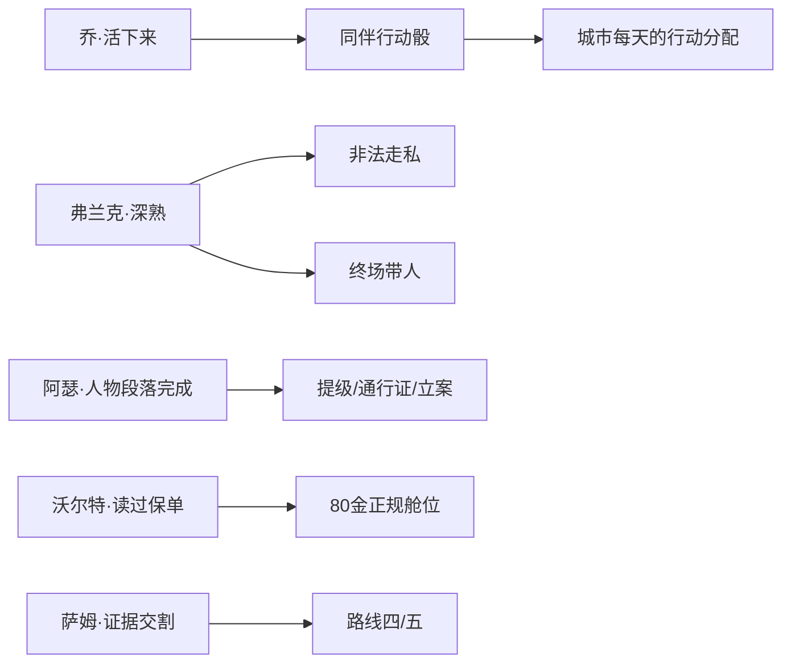

# demo短篇·剧本总表（当前基准）

> demo 短篇的全景剧本表：一条自闭环夜莺主线、四条独立人物支线，以及一名与主线暗账直接耦合的编外侦探。
> 本表用于手动审阅故事全貌；机制细节以 [../demo短篇·夜莺故事设计.md](../demo短篇·夜莺故事设计.md) 和内容脚本为准。
> 当前先建立可玩的结构基准，不在本表展开全部对白和交锋细节。

## 0. 已统一的写作规则

- 故事发生在美国硬汉侦探语境中，人物使用美国姓名。
- 中文界面、节点标题和代码中的人物名只写日常名字；全名只在名片、档案、正式介绍或特意称呼全名时出现。
- 只要节点标题或 subtitle 出现人物名字，subtitle 必须同时说明其身份，不能要求玩家先记人物表。
- 风险只有**低风险**与**高风险**两档；判定结果仍有坏 / 中立 / 好。
- 「非法」是独立标签和固定难度修正，不是第三档风险。
- demo 当前不用枪：没有初始枪械、枪械路线、枪械门槛或终场夺枪动作。

## 1. 结构原则：两种耦合

- **剧情耦合**：只有萨姆。他负责暗账的另一侧，本身就是夜莺主线的一部分。
- **能力耦合**：乔、弗兰克、阿瑟、沃尔特各自有独立生活。玩家投入行动骰建立关系，主线只在需要时读取已经建立的存量。
- 读的方向始终是**主线 ← 人物存量**。独立人物线不要求夜莺主线先发生某个结果。
- 人物支线是城市生活，demo 结束后仍可继续存在。
- 同伴以**场内技能**方式进入交锋：不提供行动骰,提供次数少、效果大的主动技能,并有台词表现。
- 弗兰克只在最终「了断」带人到场，不介入节拍二保护，也不参与送夜莺离开。

## 2. 人物表

### 2.1 独立人物线

| 日常名 | 全名 | 圈子 / 身份 | 他自己的生活 | 与主线的能力耦合 | 台词池哲学 |
|---|---|---|---|---|---|
| 乔 | Joe Doyle / 乔·多伊尔 | 劳工；码头搬运工，独自抚养孩子 | 接送孩子、意外受伤、五天照顾期；可能死亡、残疾或痊愈 | 活下来后可加入队伍，每天提供一颗城市行动骰；残疾版永久 −1 | 家庭是生活的支点。 |
| 弗兰克 | Frank Delaney / 弗兰克·德莱尼 | 劳工；码头领袖，掌握分账与灰色门路 | 清栈、查账、旧悬案、走私 | 深线完成后开放非法走私；只在最终「了断」带人到场 | 码头有码头的规矩。 |
| 阿瑟 | Arthur Bell / 阿瑟·贝尔 | 官僚；辖区警局的登记与档案职员 | 登记、文书，以及一件程序管不了的麻烦 | 延期、通行证、节拍二提级、终局立案 | 程序内的事按程序办,程序外的事记人情。 |
| 沃尔特 | Walter Finch / 沃尔特·芬奇 | 富商；保险公司的理赔调查员 | 核查骗保，在事实与条款之间作判断 | 读到夜莺本人名下的保单，独占 80 金正规舱位路线 | 只认事实与条款。 |

货运代理继续承担投资、私货销路和富商经济线，不提供夜莺舱位，也不并入沃尔特的人物线。

### 2.2 剧情耦合人物

| 日常名 | 全名 | 身份 | 在主线中的作用 | 台词池哲学 |
|---|---|---|---|---|
| 萨姆 | Samuel Rourke / 萨缪尔·罗克 | 因拒绝压案离开警队的邻城刑警，现为编外侦探 | 三次目击、暗账登场、讲亨利、同行夜查，接收半份或完整证据；不是本城警局编制内角色 | 死人也不该只剩一句“活该”。 |

### 2.3 主线人物

| 人物 | 他是谁 | 在主线里做什么 | 台词池哲学 |
|---|---|---|---|
| 夜莺 | 老街酒馆歌女；从邻城歌厅逃出，十年卖身约跑在第七年 | 委托人；提供预付金、情报、戒指并每日挣钱；她撒过谎，她的安危是胜负的一部分 | 努力改写自己的命运；挣扎中会撒谎、会犯错。 |
| 收账人 | 歌厅老板派来的人；用假名、坐船来 | 节拍一调查目标和「警告」对手；把账转到玩家头上 | 这是一笔账,不是一段仇。 |
| 歌厅老板 | 邻城歌厅老板 | 第 17 天才亲自出现；负责封口价和最终了断 | 账总要有人来清。 |
| 亨利 | Henry Quinn / 亨利·奎因 | 死者；曾是刑警，后来替歌厅老板做脏活，也给病中的妹妹寄钱 | 由萨姆补完他的人生，让夜莺的困境不只剩单一视角 | 活着时想给妹妹留一条路。 |
| 酒馆老板 | 夜莺现在的雇主 | 节拍一情报地点、服务员工作入口；抢人失败后酒馆停业两天 | 老街的人情，先看人有没有站稳。 |

夜莺保单的投保人与受益人都是夜莺本人，不做「老板是受益人」的反转。经理角色当前不进入 demo。

## 3. 时间轴（第 1–17 天）

日历只钉主线、萨姆和人物线入口；入口出现后，人物线按自己的节奏推进，但与主线争用同一批行动骰。

| 天 | 夜莺主线 | 萨姆 | 人物线入口 / 地点 |
|---|---|---|---|
| 1 | 开场「雨夜来客」；节拍一开始 | — | 乔：通过码头搬运逐渐熟悉 |
| 1–3 | 饭店、码头各有一条查访 Clock **0/4**；每完成一条，“对陌生人的了解” **0/2** 增加 1 | — | 警局开局开放；进入警局可主动见阿瑟，但不再承担节拍一调查 |
| 3 | 了解满格后可在“陌生人的藏身处”主动进入「警告」；否则陌生人上门，夜莺不安 +1 | — | — |
| 5–10 | 节拍二：交首期 60，或完成阿瑟人物段落后请他提级 | — | 弗兰克：劳工关系达到 3 后出现三天清栈邀请 |
| 浮动 | — | — | 乔：吃饭 → 接送孩子 0/8（低风险）→ 谢礼 → 约 1/3 概率受伤 → 完整五天照顾期 |
| 8+ | — | — | 沃尔特在世界入口出现，保险公司开放；错过当天不会永久消失 |
| 10 | 已有保护则场景结算；无保护进入「抢人」；第三层揭开 | — | — |
| 11 | 明账上屏：封口 480 / 付过首期 420；夜莺每日凑 40 | — | — |
| 12± | 跟梢者出现，50 金买下暗账线索 | 买消息后在警局外登场 | 暗账三处查访开放 |
| 12+ | 幕间「旧戒指」 | 暗账推进到两格后讲亨利 | — |
| 11–16 | 查真相、凑钱、落实路线 | 真相查明后接收半份或完整证据 | 沃尔特关系线可解锁 80 金保险舱位 |
| 16 | 送夜莺上船的最后一天；她对你的信任足够且真相未揭时,当晚幕间「她自己说了」 | 真相已知却不交代时，萨姆会阻止把事情直接擦掉 | — |
| 17 | 已落实路线则场景；否则进入「了断」 | 完整移交路线随案出现 | 八种结局 |

节拍二只有**首期**与**阿瑟提级**两种保护。旧的套线把柄链和码头看场保护已删除。

## 4. 四条独立人物线

### 4.1 乔：普通人的抗风险能力

乔是码头工人和单亲父亲。他表现一个普通人对一次意外几乎没有缓冲的处境。

| 环节 | 触发 | 内容 | 产出 |
|---|---|---|---|
| 熟悉 | 搬运时逐渐积累好感 | 经常在同一支队伍里工作，开始互相叫得出名字 | 关系入口 |
| 一个忙 | 好感达到 5 | 乔请玩家吃饭，说明下午班与孩子放学时间冲突 | 居民区与接送行动开放 |
| 接送孩子 | 上一环节后 | 0/8 Clock；低风险，每天最多一次，占 1 骰 | 满格进入感谢 |
| 感谢 | Clock 满格 | 乔送来三瓶酒 | 酒 ×3 |
| 受伤 | 感谢后每天约 1/3 概率 | 搬运时伤腿；五天里每天最多照顾一次，可花行动骰或药品 | 五天照顾期，与主线死线争骰 |
| 结算 | 第五个完整照顾日结束 | 进度高：痊愈；进度中：残疾；进度低：死亡 | 活下来可邀请入队；残疾版骰子永久 −1 |

乔加入队伍后每天提供一颗城市行动骰；交锋中以场内技能与台词到场。

### 4.2 弗兰克：码头灰色秩序

| 环节 | 触发 | 内容 | 产出 |
|---|---|---|---|
| 清栈 | 劳工关系 ≥3 | 三天内应约；多目标交锋，在主货、药箱和工资册之间取舍；错过后清栈消失，但「见弗兰克」永久保留 | 认识弗兰克，留下码头后果 |
| 查账 | 清栈后 | 低风险日常关系工作 | 私人好感与旧案入口 |
| 悬案 | 好感达到 3 | 隐藏条件交锋，查清被改过的分账名单 | 深熟、劳工关系提升 |
| 走私 | 悬案成功后 | 高风险、非法、每天一次 | 私货与情报；失败会官僚 −2 并产生麻烦 |
| 最终帮忙 | 深熟且进入「了断」 | 弗兰克带人到场，让一个打手退场并降低压力 | 场内增益，不是免战路线 |

弗兰克不提供「他的第七条路」，不负责节拍二看场，也不提供渔船或送行路线。

### 4.3 阿瑟：程序的边界

| 环节 | 触发 | 内容 | 产出 |
|---|---|---|---|
| 登记 | 第一次进入警局 | 「见阿瑟」常驻到玩家处理；节拍一查登记簿也会自然认识他 | 警局人物入口，不会因错过节拍一永久锁死 |
| 他的麻烦 | 已认识，且官僚声望达到「相识」 | 阿瑟观察过你在警局做事后，才主动提出「教训」委托；太轻没有结果，太重留下麻烦 | 官僚关系、阿瑟的人情 |
| 文书 | 常驻 | 低风险「整理警局文书」 | 官僚关系与少量情报 |
| 提级 | 完成人物段落 | 阿瑟把夜莺的事调到巡警会在意的优先级 | 节拍二警局保护 |
| 程序工具 | 完成人物段落 | 延期一天、办理一次性通行证 | 城市与交锋工具 |
| 立案 | 真相、萨姆的半份证据与通行证齐备 | 阿瑟把材料送进正式程序 | 路线四 |

警局只有阿瑟这一名本城职员人物，不再设置探长。萨姆在警局外活动，职责与阿瑟分开。

### 4.4 沃尔特：保险公司的冷

| 环节 | 触发 | 内容 | 产出 |
|---|---|---|---|
| 登场 | 第 8 天起 | 沃尔特在门口递来名片，请玩家协助外勤核赔 | 保险公司开放 |
| 核赔 | 登场后 | 查一名装伤骗医药费的码头工；事实查满后可坐实，也可在怀疑未满时高风险放水 | 富商关系与人物认识 |
| 保单 | 核赔后且夜莺进入第三阶段 | 沃尔特注意到夜莺本人名下的保单和紧急转移条款 | 80 金正规舱位开放 |

沃尔特不负责判断冤屈，只负责事实与条款。保险公司舱位正规、体面，也会留下完整记录。

## 5. 萨姆：主线暗账的另一侧

萨姆不是独立支线奖励人物。他因拒绝把一桩死亡写成醉酒失足而离开警队，现在以编外侦探身份继续调查。

| 环节 | 触发 | 内容 | 产出 |
|---|---|---|---|
| 前史目击 | 第 1–10 天 | 酒馆请酒、码头问潮水、警局争案卷；没有奖励，只留印象 | 登门时对成同一件事 |
| 登场 | 第三层揭开后 | 登门介绍自己，说明旧案被压，并回收此前目击 | 暗账的人物入口 |
| 同行 | 萨姆登门后、暗账待查 | 玩家可以和他一起查；他不入队、不带行动骰 | 查访文本与夜查入口 |
| 夜查货栈 | 同行后，货运查访 | 与萨姆抢在守夜人回来前翻到夜账 | 货运线直接查完；失败后可改天再来 |
| 讲亨利 | 暗账推进 ≥2 | 亨利曾穿警服，后来替老板做脏活，也一直给妹妹寄钱 | 路线五的道德重量 |
| 半份证据 | 真相查明后 | 只交老板雇凶、拐卖和压案的部分 | 路线四前置条件 |
| 完整证据 | 真相查明后 | 夜莺也进入案卷，随萨姆回邻城录口供 | 路线五 |
| 阻止擦除 | 已知真相却什么都不交 | 不能把夜莺直接送走并假装旧案不存在 | 迫使玩家作出明确交代 |

## 6. 世界读取人物存量

| 已建立的存量 | 能力 | 主线兑现 |
|---|---|---|
| 乔活下来并入队 | 每天 +1 城市行动骰；残疾版永久 −1 | 从入队次日起持续生效，不进入交锋 |
| 弗兰克深熟 | 非法走私；最终带人 | 日常经济；第 17 天「了断」场内增益 |
| 阿瑟人物段落完成 | 提级、延期、通行证、立案 | 第 10 天保护；第 17 天路线四；交锋程序干预 |
| 沃尔特有往来并读过保单 | 保险公司正规舱位 80 金 | 第 16 天前送夜莺上船 |
| 萨姆的证据交割 | 法律与道德上的明确交代 | 路线四 / 五 |
| 劳工 / 官僚 / 富商各达到相识 | 暗账三处查访各开一条 | 第 11–16 天 |

## 7. 主线三节拍与交锋

| 节拍 | 到期 | Clock / 目标 | 结算 |
|---|---:|---|---|
| 一：找到盯梢的人 | 4 | 查访 4 格 | 主动或被动进入「警告」 |
| 二：给她弄到保护 | 10 | 首期或阿瑟提级 | 已保护则场景；未保护进入「抢人」 |
| 三：她对你撒了谎 | 17 | 六条路线中落实一条 | 场景或「了断」 |

### 主线交锋

| 交锋 | 日 | 结构 | 备注 |
|---|---:|---|---|
| 警告 | 4 | 话题桌 | 假身份见好就收；主动上门 / 被动上门两种变体 |
| 抢人 | 10 | 位移轨道 | 距离经济；仅无保护时触发 |
| 了断 | 17 | 单位化两幕 | 弗兰克深熟时可带人；夜莺已离开时切无人变体 |

「夜莺·套线」已删除，不再产出把柄。

### 人物交锋

| 交锋 | 属于谁 | 结构 | 当前基准 |
|---|---|---|---|
| 清栈 | 弗兰克入口 | 多目标取舍 | 主货与两个可选目标争用行动 |
| 悬案 | 弗兰克深处 | 隐藏条件 | 线索与警觉赛跑，找出正确对象 |
| 教训 | 阿瑟的麻烦 | 见好就收 | 玩家决定何时停手；太轻失败、太重留麻烦 |
| 核赔 | 沃尔特入口 | 条款谱系 | 坐实或高风险放水；怀疑填满后只能坐实 |
| 夜查 | 萨姆同行 | 抢时间 | 夜账与守夜人巡回赛跑；萨姆的场内判断技能首例 |

## 8. 夜莺终局六条路线

| 路线 | 主要付出 | 结果形态 |
|---|---|---|
| 付钱封口 | 480 金；付过首期则 420；夜莺承担最多 240 | 场景结算 |
| 交锋了断 | 无硬门槛 | 「夜莺·了断」 |
| 送她离开 | 沃尔特解锁的保险舱位 80 金；第 16 天前送船 | 「了断」无人变体 |
| 立案送警 | 真相、萨姆半份证据、阿瑟人物线、通行证 | 场景结算 |
| 完整移交 | 真相、萨姆完整证据 | 夜莺随案回邻城 |
| 坐视不管 | 已查明真相 | 玩家明确选择不去 |

送行路线只属于保险公司。货运代理不提供舱位，弗兰克不提供渔船，萨姆也不为送行开后门。

## 9. 已裁决，不再回潮

- 节拍一是第 1–3 天：饭店、码头各 4 格；两条完成后“对陌生人的了解”2 格满并揭晓藏身处。
- 删除探长人物；警局由阿瑟和警局外的萨姆承担不同职责。
- 删除「套线 → 把柄 → 探长」整条链。
- 删除节拍二码头看场保护。
- 弗兰克只开放走私并在最终了断带人，不产生第七条结局路线。
- 送夜莺离开只读沃尔特与保险公司，不读货运代理或码头关系。
- 夜莺是自己保单的投保人和受益人。
- 接送孩子采用低风险判定。
- 全游戏风险只有低 / 高两档；非法单独标记。
- demo 当前不用枪。
- 经理不进入当前 demo。
