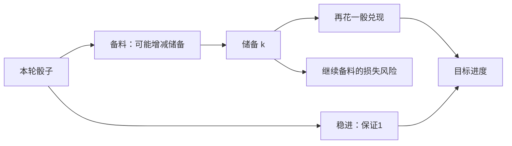
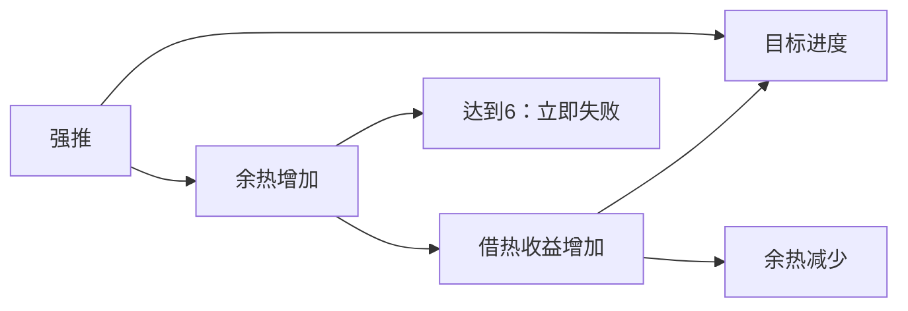

# 局部交锋的数学结构研究：首轮结果

## 结论

首轮从12个纸面候选中实现了6种小交锋，进一步检查3种，最后保留**分段兑现**和**余热转用**两个试玩候选。情报承诺虽有显著的信息收益，仍降级；其余三个原型停止深化。没有为凑第三种模式加规则。

这两种候选都只推进一个最终目标，却能产生有条件的行动选择。它们说明：“多个问题争夺行动力、不断调整处理优先级”是当前交锋设计空间的一条路径；**行动改变后续行动的价值**，以及**收益何时兑现**，也能形成不同的决策结构。

最值得继续研究的是分段兑现。余热转用更简洁，但熟练策略与求解策略之间的差距较小，可能很快变成节奏练习。两者都不能凭数学分析认证好玩：接下来的关键证据是玩家能否理解关系、产生犹豫并主动调整计划。

## 研究如何落地

只使用现有原语：四枚骰、三档判定、Clock、动作消耗、回合规则和交锋结束。规则写在正式 Content 中，独立的17个入场配置仅定义参数。没有新增 Engine 或客户端规则。

工作流是：纸面提出最小关系 → 用固定策略寻找单一套路 → 消融与相邻数值检查 → 建有限状态模型 → 回到正式会话核对转移 → 作者逐手判断 → 保留或淘汰。已有两个复杂实验不作质量参照。

初期余热原型有“冷却”，后来删除：它和借热同样减3余热，借热还可能得到非负进度，所以冷却被弱支配。情报原型初期另有失败警戒，后来也删掉，以免靠附加压力伪装信息决策。最终保留的两个原型分别只有三种和两种动作。

## 候选一：分段兑现

试玩入口：**研究·分段兑现**。目标18，三回合；储备上限5，回合末减2。

| 动作 | 消耗与结果 |
|---|---|
| 备料 | 一骰判定：坏丢2储备，中加1，好加2；储备夹在0至5 |
| 兑现 | 任意一骰，清空储备；储备1、2、3、4、5分别得到1、3、6、10、15进度 |
| 稳进 | 任意一骰，保证1进度 |

数学关系是 `V(k)=k(k+1)/2`，增加一单位储备的边际兑现收益为 `1、2、3、4、5`。集中储备能节省兑现次数并放大收益，现有储备又暴露在坏判定和回合过期中。最后还必须留一颗骰把储备变成进度。

这里的选择包括：什么时候停止积累；什么骰留给兑现；用哪颗骰保护已经积累的储备；还差一两点时是否直接稳进。只有一种资源需要监控，却同时影响风险、边际收益和剩余行动顺序。

**固定攒到5很强，但解释不了所有状态。**同样还差18、储备2、剩两回合、手中三颗骰：

| 当前手牌 | 求解选择 | 从此状态的完成率 | 最佳“先做另一动作”的完成率 |
|---|---|---:|---:|
| 1、1、1 | 兑现，用1 | 70.70% | 先稳进66.65%；先备料55.94% |
| 1、2、4 | 备料，用4 | 88.73% | 先稳进86.26%；先兑现81.34% |

“另一动作”也允许自由选择最合适的骰，并在此后按状态求解。因此差别不能简单归因于给对照用了错误骰子。这里展示的是构造状态的条件反例，不是自然游玩中发生频率的统计。

作者逐步局也出现了顺序变化。seed19首轮手牌4、3、1、4：积到4，用1兑现10。第二轮6、2、2、2：先把两颗2用在空储备和低储备，再用保留的6把储备从3推到5，最后用2兑现并完成。高骰在后段的意义是保护更值钱的现有储备，已经超过“高骰给高收益动作”的直接匹配。

这局9步，第二回合完成，冷静4；逐手理由保存在作者记录中。只有一次作者游玩，不能代表新玩家会发现同样结构。

## 候选二：余热转用

试玩入口：**研究·余热长目标**。目标16，三回合；余热上限6，回合末减1。

| 动作 | 消耗与结果 |
|---|---|
| 强推 | 一骰，先加2余热；若达到6立即失败，不再推进。未失败则坏0、中1、好3进度 |
| 借热 | 一骰，坏0；中 `1+⌊h/2⌋`、好 `2+⌊h/2⌋` 进度；随后余热减3，最低0 |

借热使用的是行动前的余热。坏判定也会减热，但得不到加成或进度。界面卡片直接显示当前档位的实际进度，不要求玩家心算公式。

同一状态既是危险，又是后续收益来源。强推不是单纯生产，借热也不是单纯维护；这使“做目标还是处理问题”转化为“怎样安排两种推进方式，让后一步更值钱”。

但它有退化风险：反复强推、借热就已经很好。因此推荐目标16配置，比目标14更需要考虑本轮手牌与剩余进度。目标12、14、16下可完成性没有崩掉，但策略差距仍然不大。

固定交替无法解释全部条件。同样还差16、余热0、剩两回合、手中三颗骰：

| 当前手牌 | 求解选择 | 从此状态的完成率 | 最佳另一动作的完成率 |
|---|---|---:|---:|
| 1、1、4 | 强推，用1 | 50.38% | 先借热48.33% |
| 1、6、6 | 借热，用1 | 84.70% | 先强推82.28% |

第二种手牌在零余热时也先借热。这里低骰的当前进度、后续高骰的顺序和下一回合能否完成共同起作用。条件反例说明存在严格的选择反转；没有测量玩家常遇到它的比例。

作者seed41逐手局：首轮用低骰强推积热，用6借热吃到4进度；第二轮手牌1、3、3、3，先用1把余热2推到4，再借热。临近结束还差2、余热3时，借热的中档就足以完成，强推需要好档，因此最后改变选择。9步，第二回合完成，冷静4。

可以做一个保持最高产出不变的纸面消融：若借热在任何余热下都固定给坏0、中3、好4，同时照常减3热，它就弱支配给坏0、中1、好3且加热的强推。消除“价值取决于先前状态”会消除两动作的相互需要。这是关系上的分析，不是另跑了一套正式样本。

## 量化证据：存在策略，规模仍然有限

下表是当前规则、技能1、初始四颗均匀独立d6的有限状态枚举。完成率采用浮点动态规划，轮数仅统计成功轨迹。它消除了小样本种子噪声，仍依赖下文的模型假设。

| 原型与策略 | 完成率 | 成功平均轮数 |
|---|---:|---:|
| 分段兑现：固定满5兑现 | 97.6559% | 2.133 |
| 分段兑现：按状态求解，优先可靠完成 | 99.7677% | 2.149 |
| 分段兑现：按状态求解，偏重尽早完成 | 99.6026% | 2.075 |
| 余热目标16：固定交替 | 99.7547% | 2.209 |
| 余热目标16：考虑即时收益与留下的热量 | 99.8415% | 2.122 |
| 余热目标16：按状态求解，优先可靠完成 | 99.9643% | 2.109 |
| 情报承诺：直接押A | 85.1664% | 2.551 |
| 情报承诺：优先用高骰探查，再执行 | 99.4862% | 2.522 |
| 情报承诺：按状态求解 | 99.4865% | 2.522 |

“可靠完成”先最大化完成概率，平手时减少成功轨迹上的轮数。“尽早完成”使用研究偏好：第1、2、3回合成功分别记12、9、6，失败0；这些分数**没有加入游戏奖励**。优先可靠完成的分段兑现会偶尔多花时间保住低概率局，所以平均轮数略高于满5策略，不构成矛盾。

技能2时，分段兑现求解完成率99.9938%，余热目标16为99.9997%，情报为99.9859%。技能提升会让取舍变弱；不能把技能1得到的结构直接外推到整个成长曲线。

这些数字证实前瞻有价值，但没有说明价值差距足以让大多数玩家感到有趣。余热最强简单策略与求解器只差约0.12个百分点完成率；分段兑现约2.11个百分点。两种原型都偏容易，当前目的主要是检查结构，不是定成品难度。

## 淘汰与消融

| 原型 | 首轮处理 | 原因 |
|---|---|---|
| 情报承诺 | 降级，保留为信息机制对照 | 查明条件大幅提高胜率，但高骰探查几乎等于全状态求解。获取信息之后主要是重复执行；信息有价值，不等于选择丰富 |
| 窗口储备 | 停止深化 | 当前配置的直接推进足以与窗口路线竞争，没形成清晰的新取舍；复杂的窗口说明没有换来相应价值 |
| 承诺分流 | 停止深化 | 立即打开高速路线的简单策略很强，承诺时机趋于固定 |
| 风险兑现 | 不计新模式 | 本轮没有超出压力累积、减压和见好就收的关系；也不能用不同奖励单位与成功型原型排名 |

余热取消转用加成时，目标14求解完成率从99.9930%变为99.5815%，成功轮数从2.034变为2.212；这是关系删除后的结果变化，但同时降低了产出，不能仅凭数字把差异全归因于策略。

分段兑现改成线性 `2k` 时，目标18求解完成率99.6103%，成功轮数2.436；取消储备衰减时为99.9683%、2.068。线性版本也改变了不同储备档的产出，所以它不是“只隔离曲率”的严格因果实验。风险、兑现消耗与手牌顺序仍可独立贡献选择。这里的证据是结构检查和条件反例，而不是某个公式唯一造成好玩的证明。

## 证据与复现边界

最终对照使用正式 Engine 会话，13个配置、每组12个留出种子501至512；三种基础原型加入两类求解策略，合计852局、8568步。最终简化在这些种子运行之前完成；此前筛选和深入对照使用其他种子。每组12局不足以估计99%以上的胜率，所以报告表格使用有限模型枚举，不用12/12冒充100%。

同种子在不同策略下也不保证每步随机结果相同：行动消耗随机数的顺序不同。所有会话独立进程，完整记录公开观察、操作、理由、事件与结果。策略不读隐藏真值、未投出的命运骰或未来手牌。

当前验证结果：

- 内容校验明确加载并渲染全部17个研究交锋；内容校验器构建成功，0警告、0错误。
- 当前852局、两个作者回归局、一个当前作者余热局、四个终止边界局，合计859局8606步；其正式转移与模型逐步核对通过。
- 从中选38局，覆盖三种机制、消融、作者轨迹、完成与终止路径，原生严格回放的观察及事件比较通过，明细见 `验证.json`。
- 四个边界局覆盖余热满6立即失败，以及三种原型第三次结束回合超时。三个作者局均无恢复品使用，分别保存了原决定或最终版回归。
- 未操作 Unity；调试入口按现有资源枚举代码确认。Unity 布局、动画、触控和真人体验均未验证。

有限模型的条件是：主角无伤、四项技能1或2，初始冷静5，每轮四颗均匀独立d6，不使用背包恢复品；判定概率读取正式会话展示的六面赔率。三回合内时间税不足以造成伤势。情报未知条件按A/B各半建模，获取线索和押定后只读玩家可见信息。浮点比较容差为 `1e-12`。

转移核对检查的是给定判定结果后规则是否一致，不能独立证明所有随机源的分布；四骰与命运骰分布仍依赖当前 Engine 契约。构造状态反例不承诺最佳策略会经常抵达该状态。固定策略精确对照未纳入依赖额外尝试次数历史的“一次探查”，该策略只在正式会话中统计。

尝试用现有“巷子里在打人”做协议参照时，会话观测被同名“生命”钟的状态一致性检查阻断。这里记录为现有观测限制，没有改战斗或协议来绕过，也没有把它算作完成的数学基线。用户描述的多人战斗关系只用于确定设计方向。

旧阶段数据保留为历史探索；规则已删减，不能拿来声称当前版回放通过。最终规则指纹、工具版本与原始轨迹均随当前分析保存。

## 下一轮应当检验什么

先让玩家盲玩两种候选各两三局，再看分析。问题应落在具体行动上：能否解释为何这次先兑现、下次继续备料；能否发现热量有双重价值；改变选择是理解关系还是记住套路；同样手牌是否让人觉得只剩唯一操作。

如果分段兑现容易读懂并反复产生自发调整，优先把它迁入真实交锋主题；若玩家只机械攒5，就研究这些反例在自然状态中的出现频率，或淘汰当前参数。余热若很快只剩固定节奏，也应降级。先验证两种简单关系是否值得玩，再决定是否扩展设计空间。
