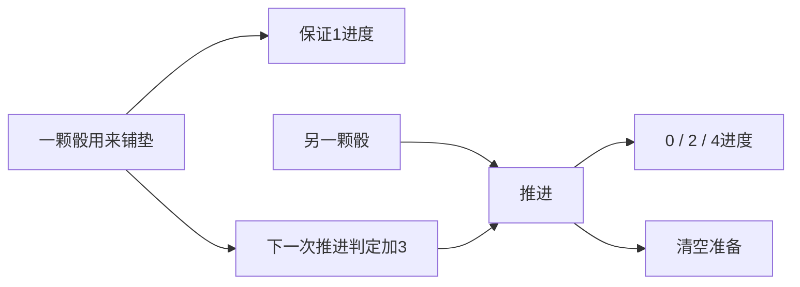

# 第二轮：从稀有反例，走向可达的选择

本轮新增两种简洁的试玩候选：**整备借力**与**稳险选择**。加上首轮的分段兑现，目前优先试玩三种；余热转用保留为对照，降低研究优先级。没有继续增加情报、窗口或叙事条件来补足数量。

| 优先试玩候选 | 除目标和期限之外的状态 | 动作数 | 核心选择 |
|---|---|---:|---|
| 分段兑现 | 一根储备钟 | 3 | 多攒一点，还是现在兑现；哪颗骰保护已有储备 |
| 整备借力 | 准备0或1 | 2 | 用一颗骰提高下一颗的判定，还是分别直接推进 |
| 稳险选择 | 无 | 2 | 当前需要稳定积累，还是需要一次较大的跳跃 |

这仍是数学原型研究，没有真人体验认证。候选之所以保留，是因为它们能用少量规则产生可达、有严格差距的选择，并有明确的退化边界。

## 先修正首轮的一项判断

首轮找到了“同样的进度、时间、机制状态，换手牌就换最佳动作”的反例，但没有说明它在正常局面中多常见。本轮从初始四骰出发，按求解策略传播每个后续状态的到达概率，检查选择差异是否只藏在极少数角落里。

下表的事件定义是：**一条求解策略轨迹上，至少出现一次这样的状态：若此刻改用参照策略的行动与骰子，此后恢复求解，条件完成率会下降至少1个百分点。**它不是玩家犯错率，也不是最终胜率减少的比例。

| 原型（技能1） | 参照策略 | 该事件的模型概率 |
|---|---|---:|
| 分段兑现 | 满5兑现，并在末骰时兑现已有储备 | 17.22% |
| 余热目标16 | 比较即时收益，同时考虑留下的余热 | 0.74% |
| 整备目标30 | 完整规划当前一轮，最大化当轮期望进度 | 22.09% |
| 稳险目标28 | 按骰面的平均进度选动作 | 15.60% |

参照策略的复杂度不同，这张表不能直接作为“谁更好玩”的排名。它支持一个较窄的结论：余热相对一个懂基本关系的简单策略，严格的额外取舍比较少；首轮不应仅凭存在反例，把它与分段兑现放在相同优先级。

本轮也找到**同一手牌、同一剩余时间，只改变目标距离**就改变最佳动作的可达例子，见下面两节。到达概率是在模型指定的求解策略下算的，不代表所有玩家的游玩分布。

## 新候选一：整备借力

推荐入口：**研究·整备借力**，目标30，三回合。

| 动作 | 规则 |
|---|---|
| 铺垫 | 任意一骰，保证1进度；准备置为1 |
| 推进 | 一骰判定：坏0、中2、好4；有准备时本次判定准备值加3，之后清空准备 |

重复铺垫不叠加加成，仍只保证1进度。回合末准备清空；它不能带到下一轮。命运条直接显示当前概率，玩家不必计算判定函数。

关系非常小：**一颗骰除了直接取得进度，也可以改善另一颗骰的可靠性。**6点骰已经保证好档，给它铺垫通常浪费；弱骰可以用于铺垫，中等骰可能借力后保证好档。但“低骰永远铺垫”也不是完整答案：铺垫会减少可用推进次数，目标距离不同，对保证收益和最大可能收益的需要也不同。

下面两个状态都来自初始条件下可达的求解轨迹：本轮只剩**2、4**，没有准备；当前是第二回合，之后还有一轮四骰。

| 还差多少 | 此刻最佳动作 | 条件完成率 | 最佳另一动作的条件完成率 |
|---|---|---:|---:|
| 17点 | 直接推进 | 78.60% | 先铺垫70.48% |
| 15点 | 铺垫，再借力 | 98.06% | 先直接推进94.39% |

另一动作也允许选最合适的骰，并在之后恢复完整求解。差17点时需要保留两颗骰直接推进的较高上限；差15点时，铺垫加一次保证好档的推进，留下更可靠的最后一轮题面。这两个状态的模型到达概率分别约0.056%、0.637%；具体例子不常见，整体偏离事件并不只由这一对状态构成。

### 为什么定稿目标是30

探索阶段先用目标32。固定“铺垫—推进”每组最多5进度，三回合六组最多30，因此这个策略在32点必败。它确实迫使玩家直接推进一部分骰，但这种胜率差异包含明显的容量边界。

于是补做了目标扫参。在**30点**，固定配对有机会完成，模型完成率约93.28%；按状态调整为99.10%。选择的价值仍在，所以推荐版本改为30；32保留为 **研究·借力紧目标**。没有靠新增条件维持区别。

| 目标 | 按状态求解完成率 | 固定配对完成率 |
|---:|---:|---:|
| 28 | 99.91% | 99.70% |
| 30 | 99.10% | 93.28% |
| 32 | 95.47% | 0% |
| 36 | 69.11% | 0% |

28太宽松，简单配对已经很好；36明显更紧，手牌质量会带来较大波动。这里是存在合适参数区间的候选，不是随便给目标数值都好玩。

去掉准备加成、其余规则与目标30不变，求解完成率降为90.98%；只规划当轮几乎就能达到同样结果。它说明准备关系对这个版本很重要，但消融也降低了有效产出，不能把胜率差全部解释为策略深度。

作者在32点探索局seed29中，首轮面对6、2、1、5：直接用6、5，再用1铺垫2。第二轮面对6、4、6、4：先直接用两颗6；剩11点和两颗4时，转为铺垫加借力，保证5进度，下一轮只差6。即使下一轮四颗骰全为1，两组配对也能保证6，于是选择较低平均收益来换保证完成。

这局12步、第三回合完成，冷静3。原决定已在当前的32点压力入口回归；**它不是一次新玩家试玩，也不是30点版本的作者盲测**。

## 新候选二：稳险选择

推荐入口：**研究·稳险选择**，目标28，三回合。

| 动作 | 坏 / 中 / 好 |
|---|---|
| 稳进 | 1 / 2 / 3进度 |
| 冒进 | 0 / 1 / 5进度 |

两动作使用完全相同的判定概率，区别只有收益分布。没有压力、储备、警戒、额外解锁或新时钟。

高骰通常更适合冒进，弱骰通常更适合稳进；但固定按骰面比较平均收益，仍不是完整策略。完成目标是一个门槛：当前积累多少，会改变下一轮“还差几格”的可完成性。最大化平均进度与最大化完成概率因此会产生不同选择。

两个可达状态：**本轮最后一颗骰都是3**，当前是第二回合，下一轮还有四颗新骰。

| 还差多少 | 此刻最佳动作 | 条件完成率 | 另一动作的条件完成率 |
|---|---|---:|---:|
| 16点 | 冒进 | 64.09% | 稳进60.32% |
| 10点 | 稳进 | 97.91% | 冒进96.80% |

3点骰冒进的平均进度是17/6，稳进是14/6。后一个状态却应该选择平均进度更低的稳进。这里没有骰子顺序可调，没有新状态可查；差异直接来自**收益波动与剩余目标、期限的关系**。两状态到达概率约0.087%、0.323%。

### 这个结构也允许不同偏好

| 目标28、技能1 | 完成率 | 成功平均轮数 |
|---|---:|---:|
| 一直稳进 | 82.02% | 3.000 |
| 一直冒进 | 92.97% | 2.581 |
| 按骰面平均收益选择 | 97.33% | 2.561 |
| 完整规划当轮期望进度 | 98.02% | 2.545 |
| 优先可靠完成的求解 | 98.70% | 2.748 |
| 偏重尽早完成的求解 | 98.16% | 2.477 |

优先完成率的策略会保住一些需要第三回合的局，因此成功平均轮数更高。效率偏好沿用研究分数：第一、二、三回合完成记12、9、6，失败0；它没有加入游戏奖励，也没有作为真人偏好的替代。

目标24、28、32时，优先完成率的求解分别为99.88%、98.70%、93.49%；按骰面平均收益策略分别为99.51%、97.33%、90.26%。增大目标逐渐提高大收益的必要性，没有整备固定配对在30点处那样的硬断层。但技能2、目标28时求解完成率99.96%，选择差异明显减弱。

作者seed39逐手局中，弱骰先稳进；第二轮得到6、5、4、1，尝试用高骰冒进争取本轮结束。4点只出中档后，本轮完成已不可能，最后一颗1改回稳进。第三轮还差5，手牌2、2、5、3，全稳进最低也能得到5，因此放弃5点骰一手冒进结束的机会，选保证完成。12步，第三回合完成，冷静3。

作者已经知道规则和研究目的。这份记录用来判断关系能否逐手解释，不能代替新玩家体验评价。

## 对整个设计空间的更新

当前至少值得区分这些关系，而不把它们都归入目标优先级：

| 关系 | 玩家真正决定的事 |
|---|---|
| 多个目标共享行动力 | 哪个问题更值得先处理；处理后未来负担怎样变化 |
| 积累与兑现 | 多承担一点损失风险，是否值得更高边际收益和更少兑现次数 |
| 行动之间转移判定优势 | 哪颗骰直接用，哪颗骰用来改善另一颗；何时保留更多推进次数 |
| 收益波动与期限 | 需要保证一个较小结果，还是需要出现一个较大结果 |

它们都使用现有骰子、判定和回合规则，但决定的关系不同。新的规则数不是主要成果；**能否用更少状态，把改变选择的原因说清楚**更有价值。

也得到两个重要限制。第一，技能成长容易把动作变成保证好档，三种新旧候选在技能2时都更接近简单解；它们还没有覆盖整个成长曲线。第二，整备目标30几乎总在第三回合完成，主要考验骰子安排，时间上的选择不如稳险明显。不同候选可以承担不同体验职责，不必每个都同时拥有全部策略维度。

## 实际验证与数据身份

定稿新增两份规则脚本、八个入场配置；首轮24份规则和配置逐字保持原样，旧候选的有限模型完成率与轮数也回归一致。没有改 Engine、客户端 UI 或既有复杂实验。

当前定稿证据：

- 正式会话400局：基础对照192，邻域96，技能32，旧候选回归16，额外留出64；留出种子801至816在定稿参数确定后使用。其余复核种子与探索阶段部分重用，不称作独立留出。
- 两个终止边界局，覆盖准备跨回合清空，以及两种新原型第三次结束回合超时。
- 一个当前稳险作者局，一个32点整备原决定回归局；合计**404局、4928步模型转移核对通过**。
- **37局原生严格回放通过**，比较完整观察与事件，覆盖完成、超时、消融、不同技能、参照与求解策略、作者轨迹。
- 内容校验明确载入八个新增配置；内容校验器构建0警告、0错误；研究工具通过语法编译检查。
- 未操作 Unity；客户端画面、触控和真人体验未验证。可用现有调试面板直接进入。

404局属于同一正式内容与C#构建指纹，详见 `定稿/版本.json` 和 `定稿/验证.json`。其中的有限模型是浮点枚举，不把小样本16/16说成总体100%。概率读取正式公开命运条，包括实际准备后的命运条，不维护另一个判定表。

模型条件与首轮相同：无伤、初始冷静5、每轮四颗独立均匀d6、技能1或2、不用烟酒药品。主要求解目标先最大化完成概率，平手时减少成功轨迹上的轮数；未来随机结果只按分布枚举，不读取真值。占用传播的概率总和与初始求解完成率互相核对。

逐步转移核对检查实际判定后进度、准备、回合、终止结果；新原型另检查终止轮数、冷静与准备附记。它不能独立证明随机源的分布。自然可达反例依赖指定求解策略，也不能说明真人会遇到相同比例的状态。效率求解只完成数学分析，不声称已经作为独立策略在正式会话运行。

`探索/`保留定稿前的321局及当时的验证和版本：整备主目标为32，无准备对照也为32。它们通过过当时版本的回放，当前指纹会拒绝直接重放这些历史记录。`目标扫参/`明确标记为模型扫参；26、34等没有正式入场配置，不声称这些数值跑过正式会话。

## 下一次研究最值得解决的问题

优先盲玩三种候选，验证“读懂后仍要调整”是否成立；随后才决定迁入真实交锋。数学侧有两个具体方向：找出能随技能改变而保持取舍的参数范围；检查部分未知的未来手牌或目标信息，是否能提高计划价值而不再引入一套复杂的信息规则。

这两个方向仍应遵守本轮的筛选标准：如果需要不断加状态、例外或新事件才能维持区别，优先放弃当前版本。
