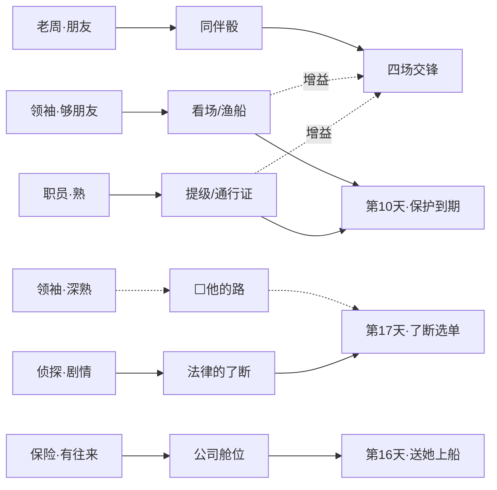

# demo短篇·剧本总表(草稿,待手动调整)

> demo 短篇的**全景剧本表**:自闭环主线 + 四条独立支线,供手动审阅调整;调整后交 agent 实现。
> 机制细节以 [../demo短篇·夜莺故事设计.md](../demo短篇·夜莺故事设计.md) 为准。
> 标 ⬜ 的是待裁决项,标 ✍ 的是需要手写补充的空位。
> 可视化版本(同内容):claude.ai/code/artifact/59b688f3-47cd-4717-bf08-623023e770d9

## 0. 结构原则:两种耦合

- **剧情耦合**(全 demo 仅侦探一人):他就是暗账那一侧,主线的一部分。
- **能力耦合**(其余所有人):支线是他们自己的生活,与主线互不纠缠。
  参与是玩家的选择,付出行动骰,回报是关系;关系在主线的到期日被"读出来",
  兑现为门路、提级、人手,乃至一条别人没有的路。
- 读的方向永远是**主线←存量**,不反向:支线剧情从不需要主线发生什么。
- 支线是生活,跨章存续;demo 结束后他们还在。

## 1. 人物表

### 1.1 支线人物(有自己的生活)

| 人物 | 圈子 | 他的生活(一句话) | 与主线的耦合 | 状态 |
|---|---|---|---|---|
| 老周 | 劳工 | 单亲爸爸,搬运工;一次伤病就可能留下永久损耗的底层处境 | 能力:同伴骰(支线结算后;可能残疾/死亡) | **按 §3 新表重做**(现行招募即入队) |
| 工头领袖 ✍(名字) | 劳工 | 码头的灰色秩序:裙带、分钱名单、走私旧悬案(老周家也在名单上) | 能力:看场人手/渔船门路;深熟→⬜"他的路" | 新增 |
| 职员 ✍(名字/职衔) | 官僚 | 辖区、指标、上面压下来的数字;讨厌不稳定;你的事他不管——"出了后果才归我们管" | 能力:通行证/延期;熟→把你的事在局里提级 | **部分已实现**:警局现有「探长」支线(走访→口供→通行证/延期)机制上就是他 ⬜见 §6 |
| 货运代理 ✍(名字) | 富商 | 生意、周转、条款里的缺口;把人也当作一份可谈的条件 | 能力:私货渠道价/满价;投资本金优惠;⬜路线三平民版舱位(80金) | **已实现**(应酬→核对条件→投资) |
| 保险经办 ✍(名字) | 富商 | 查骗保的调查员——与你同行,但他查概率不查冤屈;永远礼貌,永远在算 | 能力:有往来→他注意到夜莺的意外险→公司舱位 | 新增 |
| 侦探 ✍(名字) | 官僚 | 前警察,因不肯压案脱警服(✍原因=他的灵魂);编外才查得动;何迁旧同事 | **剧情**:暗账引导、讲何迁、证据交割 | 新增(并入原「邻城刑警」) |

> 原「邻城刑警」并入侦探,不再是独立人物;其全部戏份(何迁、交割、码头拦人)由侦探承接。

### 1.2 主线人物(只活在主线里,已实现)

| 人物 | 他是谁 | 在主线里干什么 |
|---|---|---|
| 夜莺 | 老街酒馆歌女;邻城歌厅逃出,十年卖身约跑在第七年;真名只在结局 A 出现一次 | 委托人。始终在出力(预付金、情报、戒指、每日凑40);她撒了谎;她的安危是胜负的一部分 |
| 收账人 | 歌厅老板派来的人;用假名,坐船来 | 节拍一的目标(查他的落脚处);交锋「警告」的对手;撂话"这是你的账了" |
| 歌厅老板 | 邻城歌厅的主人;咬定夜莺推死了他的心腹 | 从不露面直到第 17 天;封口价的开价人;⬜毒糖衣里的保单受益人? |
| 何迁 | 死者。老板的心腹,替他做脏活,也给病中的妹妹寄钱;侦探的旧同事 | 已死。他的人生由侦探补完——让夜莺的困境不只有她一个人的视角 |
| 酒馆老板 | 老街酒馆的主人;夜莺的雇主 | 打听消息的地方;节拍一结算后引荐服务员工作;抢人失败后酒馆停业 2 天 |
| 经理 ✍(名字) | 剧院/演出的经理(手写剧本中的角色) | ⬜ demo 短篇里目前无戏份——是否让他成为"钱这条路"的钱源?见 §6 |

## 2. 时间轴(第 1–17 天)

日历上只钉三样:主线、侦探、支线**入口**。入口之后支线不看日历,按自己的节奏走——
但消耗的是同一批行动骰。

| 天 | 主线 | 侦探(剧情耦合) | 支线入口 | 地点解锁 |
|---|---|---|---|---|
| 1 | 开场·雨夜来客(必办) | — | **老周**:码头声望≥1 即熟悉,好感随搬运自然爬——demo 最早的支线 | 初始:旅馆、老街酒馆、码头、饭店 |
| 1–4 | 节拍一·查访(6格) | — | **职员**:查登记簿认识——填表格、移交文件、等待;他不管你的事,但他自己的麻烦当场摆在柜台上 | **警局**(查登记簿);**居民区**(查访线索指向台阶上) |
| 4 | 交锋「警告」;二层揭开 | — | — | — |
| 5–10 | 节拍二·弄到保护(首期60 / 警局提级+套线 / 码头看场——后两条读交情) | — | **领袖**(浮动,码头声望≥3):一场紧急情况,限时3天,搭把手 | — |
| 浮动 | — | — | **老周·一个忙→接送孩子(0/8)→受伤**:「感谢」后约1/3概率的某天起,5天照顾期,每天最多一次——**它必然撞上某个主线死线,这是设计,不是意外**;结算=死亡/残疾/痊愈 | — |
| 8–12 | — | — | **保险经办**(浮动):他在查一单骗保,查到你常去的地方;**货运代理**(已实现):陪应酬(10金)→核对条件→投资 | 货运/保险随支线开门 |
| 10 | 到期:场景 或 交锋「抢人」;三层揭开 | — | — | — |
| 11 | 明账上屏(封口480/420,她每日凑40) | — | — | — |
| 12± | 跟梢者→买消息50金,开暗账 | **登场**(买消息后) | — | 暗账三查访(三圈各≥相识) |
| 12+ | 幕间·旧戒指 | 暗账≥2格:**讲何迁**(死者的人生;"案子是被压下的") | — | — |
| 11–16 | 查访/凑钱/落实路线 | 真相查明后:**证据交割**(交一半→路线四 / 交全部→路线五) | — | — |
| 16 | 送她上船死线(路线三) | 真相已知而不交代:他在码头拦住你 | — | — |
| 17 | 到期:选单读你的存量;场景或交锋「了断」 | — | — | 八种结局 |

**节奏红线**:节拍二的"警局提级"和"码头看场"读职员/领袖的交情——两条支线入口必须早而轻,
否则第 10 天前够不着。

## 3. 四种生活(独立支线细目)

### 老周(码头工人;支线按此重做)

老周是你在码头的一个工友，他其实是表现一个工人日常生活，抵抗风险能力，一个普通人的那一面。

| 环节 | 触发 | 内容 | 产出 |
|---|---|---|---|
| 熟悉 | 码头声望≥1 | 你在工作的队伍中经常看到老周的脸,一来二去你们就熟悉了。他是个搬运工,每次搬运都稍微增加老周好感 | 好感随日常工作自然爬升 |
| 一个忙 | 好感≥5 | 他请你去吃饭。他是个单亲爸爸,最近排班都在下午到晚上,希望有空的话你能帮他照看孩子 | 「接送孩子」开启 |
| 接送孩子 | 上一环节后 | 居民区,一个 0/8 的 Clock(每次占 1 骰,不判定或低风险判定 ✍) | 满格→「感谢」;好感继续爬 |
| 感谢 | Clock 满格 | 他送给你几瓶酒,当做谢礼 | 酒 ×N(正好接烟酒经济——他送的是交锋里的缓冲垫) |
| 受伤 | 「感谢」后,约 1/3 概率的某天 | 他在搬运中伤了腿。5 天里你每天最多照顾一次;照顾进度只通过文字模糊暗示("他脸色不太好,这样下去怕是要留病根") | 5 天照顾期——**必然撞上某个主线死线,这是设计不是意外** |
| 结算 | 受伤第 5 天 | 按照顾进度结算:**死亡**(他消失了)/ **残疾**(仍加入,但他的骰位带永久「残疾」标志,该位骰子质量 −1)/ **痊愈**。活下来的话他要报答你,可他也没钱——他同意闲下来时帮你做事(可对话邀请入队) | 同伴骰(残疾=打折的同伴骰);死亡=这条能力永远失去 |

**备注(阶级表达)**:这就是底层的生活处境——一次伤病就能造成永久损耗;没有工伤,没有医疗保险。医疗是昂贵的,只有富人、或通过保险公司的人才负担得起。**已埋的钩子**:结算台词已提到保单——"总算没求着那些开保单的——这条命是你陪出来的,不是他们卖给我的"、"他们眼里,这条腿从来就不是命,是一笔账"。**保险经办的冷,老周先替玩家说过一遍了。**

**已裁决(2026-07-16)**:同伴骰改为支线结算后才获得(现行实现是招募即入队);"死亡=同伴骰永久失去"保留——demo 第一个不可逆的存量损失,它让照顾期的每颗骰子都有重量。交锋难度基准按"可能没有老周"校验。

### 工头领袖(入口+浅层)

**表现形式:两场交锋(入口+悬案)夹一条日常通道**——他的世界就是要动手的世界。它代表了底层阶级中裙带关系、精明、势力地位，非法暴力等。

| 环节 | 触发 | 内容 | 产出 |
|---|---|---|---|
| 入口·紧急情况 | 码头声望≥3 | **交锋「清栈」✍(名字占位)**:公司稽查队三天后到,一批压栈的私货必须连夜转走。限时 3 天内应约进场;场内是货单式多目标——舱位有限、时钟在走,救哪几箱你挑 | 好感 +1;一份随机的美差;没救下的箱子=码头有人这月分不到钱(文案留疤) |
| 查账 | 认识后,日常 | 替他查账(码头账房),每次增加与他的好感 | 好感爬升的日常通道(城市推进) |
| 悬案 | 好感≥✍ | **交锋「悬案」✍(名字占位)**:走私旧悬案,他的往事——你替他去查/去了结当年那件事 | 深熟;他的过去露出一角 |
| 走私 | 悬案交锋后 | 参与每天的走私工作,高额回报(城市推进) | 日常高收入通道(每天一次;坏结果→官僚−2+麻烦) |
| 他的路 | 深熟 + 了断日 | "他是有办法的人"——了断选单多一条别人没有的路 | ⬜ demo 内做,还是只埋交情下章兑现 |

**已裁决(2026-07-16)**:
- **入口档位=码头声望≥3**(相识档内,第 10 天前可达,节奏红线解除);悬案/走私仍留在关系深处。
- **走私的经济闸**:坏结果→官僚−2+「麻烦」时钟照旧;吞吐上限每天一次(需他点头)。防支配策略回潮。

### 职员(官僚圈账法靠他呈现)

**表现形式:一场交锋(他的麻烦)+其余程序推进**——程序的世界里,交锋只发生在程序照不到的地方,而且永远不是他亲自动手。

| 环节     | 触发       | 内容                                                                   | 产出                   | 状态                                            |
| ------ | -------- | -------------------------------------------------------------------- | -------------------- | --------------------------------------------- |
| 登记案件   | 节拍一,查登记簿 | 填写表格、移交文件,等待几天;"这种事多了,出了后果才归我们管"                                     | 认识;官僚账法首次呈现          | 新增(现有查登记簿只是一次判定,没有他的脸)                        |
| 他的麻烦   | 认识后,浮动   | 替他消化不想沾手的杂事——**交锋「教训」✍(名字占位)**:一个程序治不了的人(抓了就放、罚了再犯,✍对象是谁),他需要程序外的手。你去教训他一顿; 作为回报,你得到一些方便,一位朋友 | 官僚声望;关系爬升            | 新增交锋(与主线「套线」同属"替他做他做不了的事",但这件与主线无关) |
| 业绩，和提级 | 关系·熟     | 他肯把你的事在局里提到一定高度                                                      | 节拍二警局保护线可谈(巡警守酒馆)    | 已实现(现为"官僚≥相识"门槛)                              |
| 立场     | 暗账推进时    | 一句比一句冷的"别翻了"——安稳,不是正义                                                | 与侦探的对拉;路线四=他能接受的最大真相 | 新增                                            |
| 麻烦     | 官僚敌视时    | "摆平警局的麻烦"(交际,受关系难度修正)                                                | 麻烦时钟清除               | 新增(「麻烦」时钟机制已有,此动作给它一个官面出口)                    |

### 保险经办(轻:一场交锋+两场戏+兑现点)

**表现形式:入口是一场有道德重量的交锋,其余是场景。**

| 环节  | 触发      | 内容                       | 产出               |
| --- | ------- | ------------------------ | ---------------- |
| 入口·核赔 | 浮动 | 他在查一单骗保,查到你常去的地方,请你帮忙核外勤——**交锋「核赔」✍(名字占位)**:对质报案人。查下去会发现:装伤的是个码头工,骗的是医药费(老周说过的那句话在这里应验——医疗只属于富人和保单)。**坐实**=富商声望+、经办满意;**放水**=要一次风险判定,瞒过他 | 认识;富商声望、钱;一道留在文案里的疤 |
| 案头  | 有往来后    | 他注意到夜莺的那份意外险;⬜毒糖衣藏在他的档案里 | 路线三·公司舱位解锁(体面、快) |
| 送行  | 路线三送她上船 | 他远远站着,点头,离开              | 富商圈的冷,一镜到底       |

### 货运代理(已实现;富商圈的第一张脸)

**表现形式:全程城市推进**——交易的世界里一切都在桌面上谈,不动手。

| 环节 | 触发 | 内容 | 产出 | 状态 |
|---|---|---|---|---|
| 陪货运代理应酬 | 货运公司 | 交际,占 1 骰 + **10 金**——富商圈从第一步起就要你先掏钱 | 他给你一份项目条件 | **已实现** |
| 核对代理人的条件 | 应酬后 | 敏锐。条款绕得深;抓住缺口,他才把你当谈判对手 | 投资机会开放 | **已实现** |
| 考察 / 投资 | 项目开放后 | 考察项目、投本金、等回报(富商·座上宾:本金优惠 15) | 钱生钱;私货渠道价/满价 | **已实现** |
| ⬜ 平民版舱位 | 富商·有往来 | 路线三的正规舱位 80 金 | 送她走的平价路 | 已在故事设计中,⬜是否明确长在他脸上 |

**账法示例(写内容时对照)**:同样是求人办事,老周那条是"少上一班工"(先付出、后回报、不谈价);代理这条是"先掏 10 金上桌"(明码、即时、货银两讫);职员那条是"填表、移交、等几天"(程序、延迟、看指标)。

### 侦探(剧情耦合,全做)

人设:前警察,因不肯压案脱了警服(✍原因=他的灵魂,与他的性格和生活哲学有关);编外身份才查得动,才用得了非常理的手段;何迁的旧同事;允许麻烦,甚至制造麻烦。

**表现形式:全程场景+城市推进(暗账查访)**——他不需要自己的交锋,主线的暗账就是他的战场。

| 环节 | 触发 | 内容 | 产出 |
|---|---|---|---|
| 登场 | 买下跟梢者消息(50金)后,警局外 | 他不在编制里,却比谁都熟这栋楼;他知道你在查什么 | 暗账三处查访的引导 |
| 讲何迁 | 暗账≥2 格 | 死者的人生:替老板做脏活,也给病中的妹妹寄钱,曾是他同事;"案子是被压下的"(不点名谁压的) | 路线五的道德重量;第二章的冰山一角 |
| 证据交割 | 真相查明后 | **交老板那一半**→他追雇凶、拐卖、压案,夜莺栈桥上的部分先不写死 **交完整真相**→他带她回邻城录口供、面对死者亲属 | 路线四 / 路线五 |
| 码头拦人 | 真相已知却不交代,第 16 天送她上船 | 他在码头拦住你——送走不再是无代价的擦除 | 玩家仍可选封口/交锋/坐视 |

**与职员的对拉**(demo 最重要的一组冲突):同一栋楼、同一条官僚声望,一个把案子压进抽屉,一个把它翻出来。玩家每推进一格暗账,职员的脸色差一分、侦探往前一步。⬜ 是否点破"当年压案的正是职员这条晋升线上的人"——建议 demo 只露一角,第二章展开。

## 4. 世界读你(存量→能力→主线时刻)

| 关系存量          | 点亮的能力                    | 主线时刻                  | 状态  |
| ------------- | ------------------------ | --------------------- | --- |
| 老周·朋友         | 同伴骰到场(每天+1骰;支线结算后才获得;残疾版=其骰位质量−1;死亡=永久失去) | 结算之后全程;交锋「抢人」「了断」中"请老周出面" |     |
| 领袖·够朋友        | 看场人手一句话;渔船夹带门路           | 第10天保护;第16天上船;交锋增益    |     |
| 领袖·深熟         | ⬜"他的路"                   | 第17天了断选单              |     |
| 职员·熟          | 案子提级;通行证/延期              | 第10天保护;交锋增益           |     |
| 货运代理·有往来/座上宾  | 私货渠道价18/满价25;本金优惠;正规舱位80 | 全程经济;第16天上船           |     |
| 保险·有往来        | 公司安排的舱位(体面、快)            | 第16天送她上船              |     |
| 侦探(剧情)        | 法律的了断                    | 路线四/五;第17天            |     |
| 劳工/官僚/富商 各≥相识 | 暗账三处查访各开一条               | 第11–16天               |     |

## 5. 交锋清单(全部按新底盘重做)

| 交锋 | 日 | 结构(交锋结构库) | 副目标槽 | 备注 |
|---|---|---|---|---|
**主线四场:**

| 交锋 | 日 | 结构(交锋结构库) | 副目标槽 | 备注 |
|---|---|---|---|---|
| 警告 | 4 | 赛跑 | ✍ | 你上门/他上门两变体不变 |
| 套线 | 5–10浮动 | (节拍二警局线) | ✍ | 产出「把柄」 |
| 抢人 | 10 | 守局 | ✍ | 无保护才触发 |
| 了断 | 17 | 多阶段合同 | ✍ | 无人变体保留;⬜枪的一次剧本化亮相放这里? |

**支线四场:**

| 交锋 | 属于谁 | 结构(交锋结构库) | 备注 |
|---|---|---|---|
| 清栈 ✍ | 领袖·入口 | 多目标取舍(货单)★ | 救哪几箱你挑;它本身就是副目标结构,不另配副目标 |
| 悬案 ✍ | 领袖·深处 | 隐藏胜利条件(侦探场)⬜ 或 迷雾开局 | 他的往事;具体案情 ✍ |
| 教训 ✍ | 职员·他的麻烦 | 见好就收(push-your-luck)⬜ | 教训到什么程度你自己收手——收得太轻他不服,压得太狠出麻烦(麻烦时钟);对象 ✍ |
| 核赔 ✍ | 保险经办·入口 | 谱系结局(谈判换价) | 坐实/放水两种收口;装伤的码头工=老周主题的回声 |

新底盘=烟(流量缓冲)+酒壶(一次性)+时间压力打压力+每场一个副目标;长度调到"缓冲垫勉强不够"。
支线交锋比主线短一档(玩家是顺路帮忙,不是生死账)。

## 6. 待裁决清单

- ⬜ 支线各做到哪一档:老周不动;职员全做;保险轻做;领袖入口+浅层——悬案和"他的路"留 demo 还是第二章?
- ⬜ 领袖的"第七条路":demo 内做,还是只埋交情、下一章兑现?
- ⬜ 毒糖衣:保单受益人=歌厅老板?(放在保险支线深处,查他的档案才看见)
- ⬜ 枪在「了断」剧本化出现一次(对方的枪,可夺)?
- ⬜ 四场交锋的副目标各是什么(货单模式)?
- ✍ 三个新人物的名字(领袖/职员职衔/保险经办)、侦探的名字与脱警服的原因;接送孩子 Clock 是否判定。

**已裁决(2026-07-16)**:领袖入口=码头声望≥3;走私闸=坏结果官僚−2+麻烦、每天一次;老周同伴骰=支线结算后获得,死亡永久失去(交锋难度按"可能没有老周"校验)。
