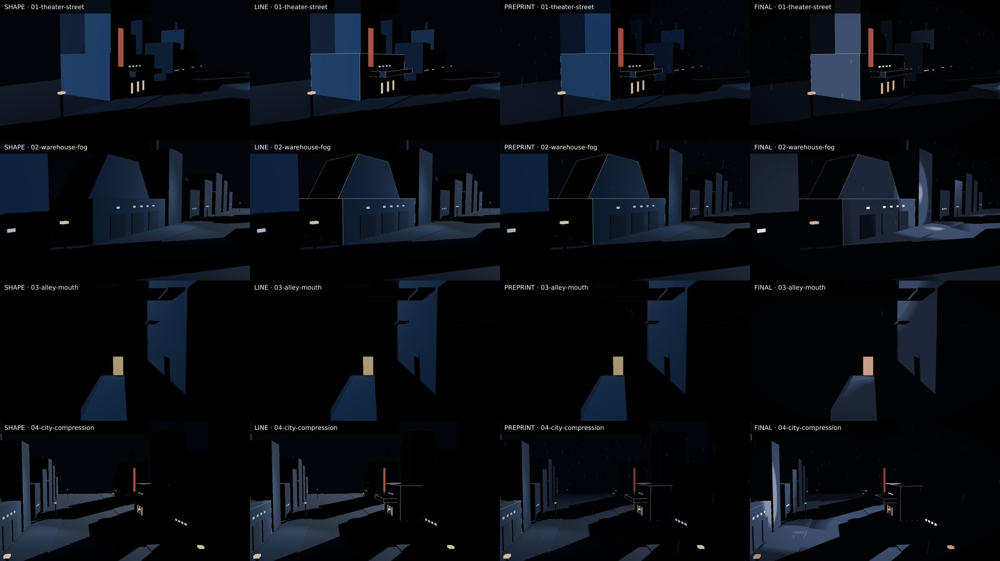

# 2026-10-03 — 本地视觉循环

基线：`e6bc88cacda86b7db0253dd0bda05a46795b7465`；Actions run `37126018704`，artifact `11274632881`。
先下载并观察该 artifact，再在 Linux headless shell 复现；本轮共完成 15 次成功截图运行，包含完整回归与局部试拍。

## 最终审阅

| 镜头 | black<2% | bright>20% | 观察 |
|---|---:|---:|---|
| Theater Street | 66.9% | 11.2% | 红牌、入口和亮侧面形成地标；飞塔降为 Context 后不损失体量阅读。 |
| Warehouse Fog | 61.5% | 7.0% | 工业轮廓保留；周围街屋仍退入黑暗。 |
| Alley Mouth | 84.2% | 2.7% | 顶棚遮住近景；中景单侧墙受光；平台切出黑块；小段地面亮路通向暖门。 |
| City Compression | 81.1% | 12.1% | 飞塔不再被上缘截断；巨大的白色线框消失；黑色近景遮挡保留。 |

已逐张打开 Final 全尺寸图，并检查四列 contact sheet。原始图在 `final/`、`shape/`、`line/`、`preprint/`。
统计用于比较，不是审美评分。最终版本的完整配置与源码 SHA-256 见 `manifest.json`；当前本地工作副本通过 connector 获取，Git SHA 为 null，不能把基线提交当成新源码的 SHA。

## 可比较的阶段证据

- `baseline/`：交接 artifact；另保留原始后巷 Final，清楚显示双侧大白弧。
- `accepted-alley/`：后巷第一次稳定的单侧切光版本，尚未改第四镜头和雨。
- `framing/`：第四镜头重构与剧院飞塔 Context 线，尚未减弱雨。
- 本目录根：减弱雨、进一步移远摄影灯后的最终版本。

灯位早期试验没有保留：巷内近灯形成弧形；过远但错误方向的灯被街屋挡住；过宽的侧上方灯提亮邻近屋顶。
最终摄影灯并非世界中的实际灯具，它属于场景摄影设计。仍使用真实 SpotLight、距离衰减和几何阴影，没有屏幕假光斑或 Object3D Light Layers。

## 验证

- `npm run build` 成功。
- 完整 16 图截图、单镜头单模式截图、`--help` 均实际执行。
- 在 `setShot` 中暂时注入 console error：任务约 5.1 秒失败并返回非零状态；随后恢复源文件。
- 本机完整截图阶段约 14–18 秒；单图整次调用约 5 秒。未把观察时间、代码修改和依赖安装算进截图阶段。

## 后续边界

这一版是 Line / Light 的阶段基线。建筑仍是研究体块，未宣称资产生产已经成熟。
下一步先研究雨的空间可见性、远近空气与可交互对象的阅读，再引入新的资产或叙事状态。
Print 本轮保持原参数。

## 独立 CI 复核

修订提交 `1120fd879371096eb733f6a802dcd771c8709b98` 的 run `37129184713` 成功，artifact `11276256998` 已下载并实际打开 contact sheet 审阅。
Chrome 154 的 src 指纹与本地一致，四个 Final 的 black<2% / bright>20% 在报告精度内一致。CI 截图阶段 45.9 秒，本地约 17 秒。
长期保留的 CI contact sheet、manifest 与报告在 `ci/`，不会随 artifact 到期丢失。
