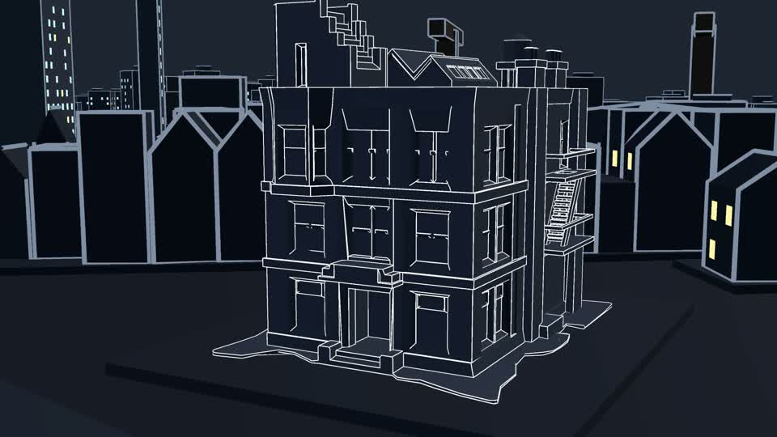
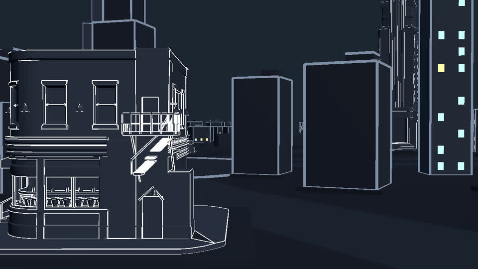
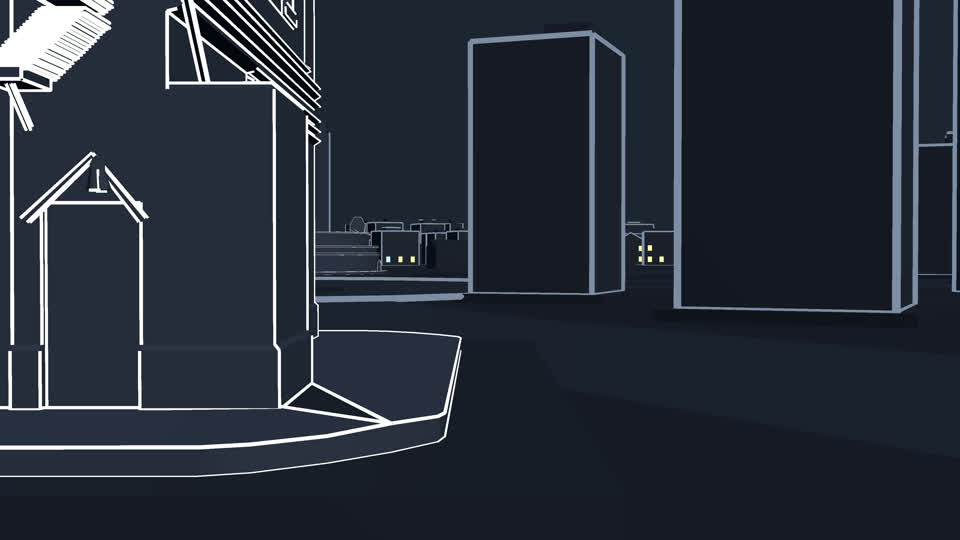

# 场景图规范

判定标准在 [SKILL.md 第 2 节](../SKILL.md)。这里是配真实截图的好例与坏例。
每次用户交进来一张新图，判完之后如果它推进了认识，就往这里加一条。

---

## 坏例：多层 isometric

尼尔住的那栋出租楼，斜俯视，楼体本身有三四层退台、外挂消防梯、屋顶一堆管道和水箱。

**不过第 5 条，重点是不过"结构稳定易识别"这个总要求。** 模型对这种多层级退台
+ 非典型建筑轮廓的理解不稳，门在哪、台阶有几级、消防梯挂在第几层，它每一帧的答案都可能不一样。
实际生成时门的位置和形状全程在变。

不是说这张图丑——它作为游戏画面很好看。是这套几何超出了这个模型能稳定复现的范围。

---

## 半合格：结构撑住了，但没有锚点

老街酒馆的侧面，左边能看见吧台和高脚凳，右边是一大片开阔路面。

**过了第 1 条**（吧台和高脚凳让人认得出这是酒馆），**结构也没漂**——实测楼的体块、
消防梯、雨棚、背景那两个黑盒子全部保持在原位。所以"大片暗区会导致结构崩坏"这个担心是多余的，
结构其实相当稳。

**但栽在第 2 条和第 3 条**：

- 动作区没有任何锚点，没有门、没有灯。人物只能凭空出现在路面上。
- 右边接近一半是无特征的开阔地面，实测两条片子都出现了**动作往右漂**——
  人物打着打着就走到那片空地上去了，因为那儿没有任何东西告诉它"别过去"。

另外这一版还栽了一次**风格漂**（整栋楼被重新打光成暖色实体渲染），
但那次的成因是提示词写坏了，不是图的问题，见 [踩过的坑.md](踩过的坑.md)。

---

## 好例：有门、有灯、有地面边界

同一片区域，机位压低推近。左边是一个带尖顶雨棚的门洞，雨棚下吊着一盏灯；
人行道那条白线一路扫到画面底部。

**五条全过，而且第 2、3 条是靠这张图的构图挣来的：**

- 门洞给了人物一个"从哪来"的出口。实测模型自己把门打开成黑色洞口，
  让三个人**依次从门里走出来**——这个调度我们没写，是它从画面里读出来的。
- 雨棚下那盏灯把动作区照亮了，人从暗处走进光里是现成的戏。
- 人行道那条线把地面的高度关系钉死，四个人站在同一个平面上不会飘。

**代价**：这个机位认不出这是酒馆（左边那面墙没有开窗）。
如果这条片子要独立成立、需要交代地点，得往左摇一点把带窗的墙带进来。
如果它紧接在"走进酒馆"之后，地点已经交代过，那就够用。

---

## 给用户重截图时该怎么说

不要只说"这张不行"。指出**不过哪一条**，以及**往哪个方向调机位**：

- 缺锚点 → "往左（右）摇一点，把那个门 / 那盏灯带进画面"
- 主体被切 → "退一步，让整个门脸进画面"
- 大片空地 → "压低机位推近，让前景的地面线占住画面下缘"
- 认不出地点 → "把招牌 / 窗户 / 吧台这类特征带进来"
